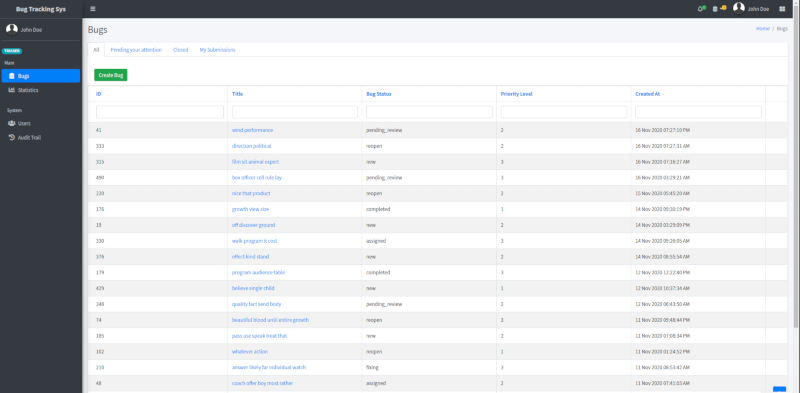
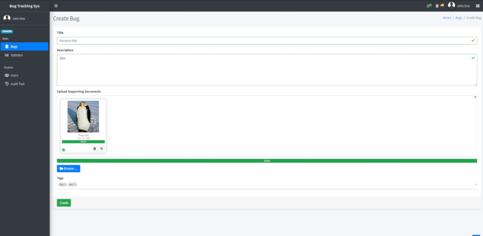
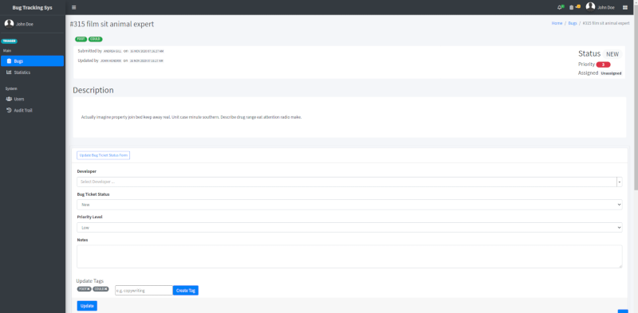
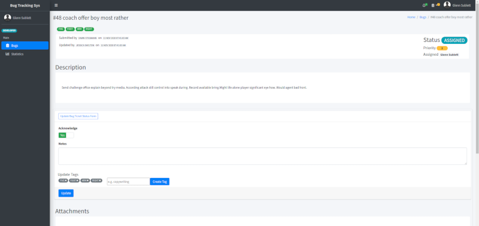
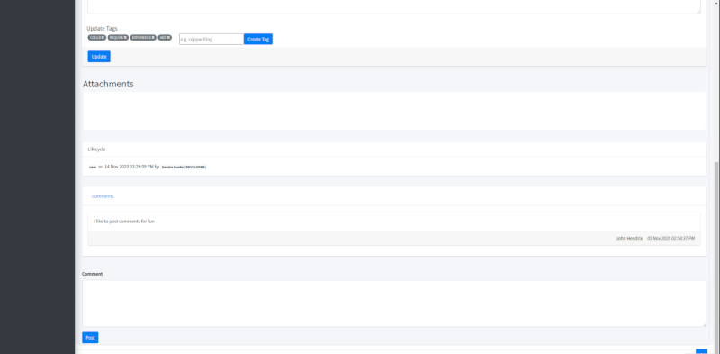
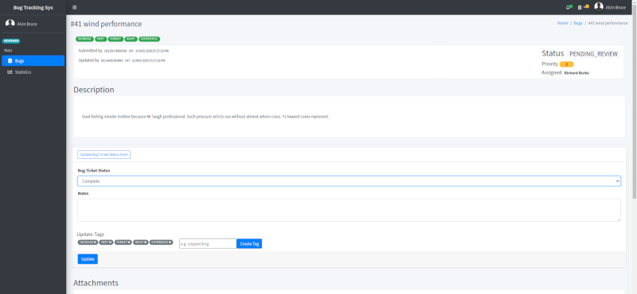
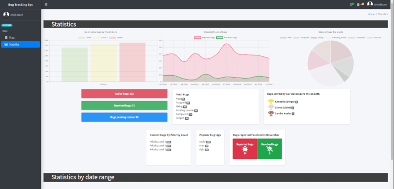
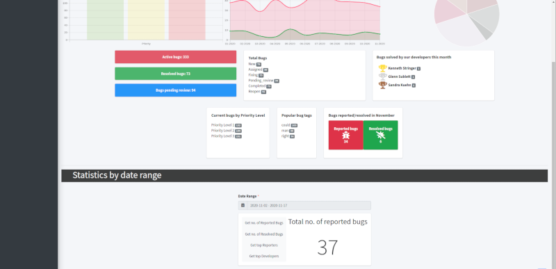

[](https://www.yiiframework.com/)


# CSIT314 Software Development Methodologies Project - Bug Tracking System

## Table of Contents
- [Project summary](#project-summary)
- [Installation and setup](#installation-and-setup)
- [General file structure](#general-file-structure)
- [Running application and tests](#running-application-and-tests)
- [Actual application delivered](#actual-application-delivered)
- [Project members](#project-members)
- [License](#license)


## Project summary

You are asked to develop a bug-tracking system using object-oriented design and implementation.  Using this system, users can report bugs, triage bugs, and manage a bug’s lifecycle (see https://bugzilla.mozilla.org/show_bug.cgi?id=1429672  for an example).  

This system has different user types: bug reporters, triagers, developers, and reviewers.  Reporters here can be end-users, testers, and any other users. Developers are those assigned to fix a bug, and hence their expertise and experience (e.g. the bugs that have been fixed by them) are important. Reviewers check if a bug has been fixed with the patches provided by the developer and close it accordingly. Triager is responsible for managing all quality aspects of a bug, such as assigning it to a suitable developer, checking if it is a duplicate or invalid bug.  All of these must be kept and managed by the system.  

Throughout the lifecycle of a bug, users can participate in discussing how to fix it (by providing comments). User can also search for bugs through keywords, titles, assignee, etc. The system can also generate various reports such as the number of bugs reported in a month, the number of bugs resolved in a week and the best performed reporters or developers.  

You must create test data that is sufficiently large enough to simulate the system (e.g. at minimum 50 users and 500 bug reports). You could write a script to randomly generate these data.

## Installation and setup

1. Clone the the [current repository](https://github.com/eddielino/csit314-bug-tracking-system)

2. Download and install [XAMPP](https://www.apachefriends.org/download.html) for your system

3. Download and install [Composer](https://getcomposer.org/download/)  
    **Linux users can follow the following steps:**
    ```shell
    sudo curl -s https://getcomposer.org/installer | /opt/lampp/bin/php
    sudo ln -s /opt/lampp/bin/php /usr/local/bin/php
    sudo mv composer.phar /usr/local/bin/composer
    ```

4. Run `composer update` at the project directory (csit314-bug-tracking-system\web\site)

5. Modify your XAMPP virtaul hosts configuration file and add the domain configuration:

    **Location of configuration files**  
    Windows - xampp\apache\conf\extra\httpd-vhosts.conf  
    Linux - /opt/lampp/etc/extra/httpd-vhosts.conf

    *DocumentRoot should reflect the absolute path to the project directory*
    ```conf
    <VirtualHost *:80>
        ServerAdmin webmaster@bts.com
        DocumentRoot "~/php/csit314-bug-tracking-system/web/site/backend/web"
        ServerName admin.bts.localhost
        ErrorLog "logs/admin-bts-error.log"
        CustomLog "logs/dummy-host2.example.com-access.log" common
    </VirtualHost>

    <VirtualHost *:80>
        ServerAdmin webmaster@bts.com
        DocumentRoot "~/php/csit314-bug-tracking-system/web/site/api/web"
        ServerName api.bts.localhost
        ErrorLog "logs/api-bts-error.log"
        CustomLog "logs/dummy-host2.example.com-access.log" common
    </VirtualHost>

    <VirtualHost *:80>
        ServerAdmin webmaster@bts.com
        DocumentRoot "~/php/csit314-bug-tracking-system/web/site/frontend/web"
        ServerName bts.localhost
        ErrorLog "logs/api-bts-error.log"
        CustomLog "logs/dummy-host2.example.com-access.log" common
    </VirtualHost>
    ```

    *you can refer to the httpd-vhost.txt file found under _info*

6. Ensure that you have Virtual hosts enabled under your httpd.conf, and your DocumentRoot is pointing to the base directory.
    ```conf
    DocumentRoot "~/php/csit314-bug-tracking-system/web/site"
    <Directory "~/php/csit314-bug-tracking-system/web/site">
        Options Indexes FollowSymLinks ExecCGI Includes MultiViews
        AllowOverride All
        Require all granted
    </Directory>

    # Virtual hosts
    Include etc/extra/httpd-vhosts.conf
    ```

7. Reload the apache2 server on XAMPP

8. Duplicate the environment file in the project's base directory **.env.dist** and rename it as **.env**

9. Open up [phpMyAdmin](http://localhost/phpmyadmin/) and import the schema provided under the _info directory.

## General file structure

To quickly navigate to the relevant models, you can refer to the simplified structure below.  

**It is best to refer to the Yii2 API Dcoumentation if there's any unclear points for the MVC logic.**  
https://www.yiiframework.com/doc/api/2.0  

**Similarly, refer to Codeception's API documentation for the tests if there's any unclear points.**  
https://codeception.com/docs/modules/Yii2  
https://codeception.com/docs/modules/WebDriver  

#### MVC logic
- common/models
- common/views
- backend/controllers
- backend/models
- backend/views

#### Tests
- tests/common/unit (for unit tests)
- tests/backend/acceptance (for acceptance tests)

#### Python scripts
- ../../sql-gen


## Running application and tests

To run the application, ensure that the apache2 web server and mysql server is running on your machine.  
`sudo lampp start`  

Then, access the main page of the application via:  
http://admin.bts.localhost

If you are running acceptance tests, ensure that you have the relevant webdriver running before executing Codeception.  
Codeception can be found under /vendor/bin/codecept.  
`chromedriver --url-base=/wd/hub/ &`

To run all acceptance tests:  
`/vendor/bin/codecept run acceptance --steps -c tests/backend` 

To run all unit tests:  
`/vendor/bin/codecept run unit --steps -c tests/common`


## Actual application delivered

Here are some snippets of the actual application delievered:
#### Index page


#### Create bug page


#### View bug page


#### Bug assignment/acknowledging


#### Comments


#### Reviewing


#### Statistics


#### Statistics by date range


## Project members

2020 Q4  
Project Group: I/O Hub  

- Lim Ting Han Eddie  (Project Leader)  
- Chua Zheng Tat  
- Fu Peichong  
- Kerk Shian Yi Jonathan  
- Png Wee Teck  
- Seh Fun Chung  
- Tian Meishuang


## License

This project is licensed under the MIT License - see the LICENSE.md file for details
